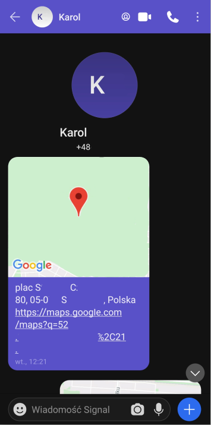
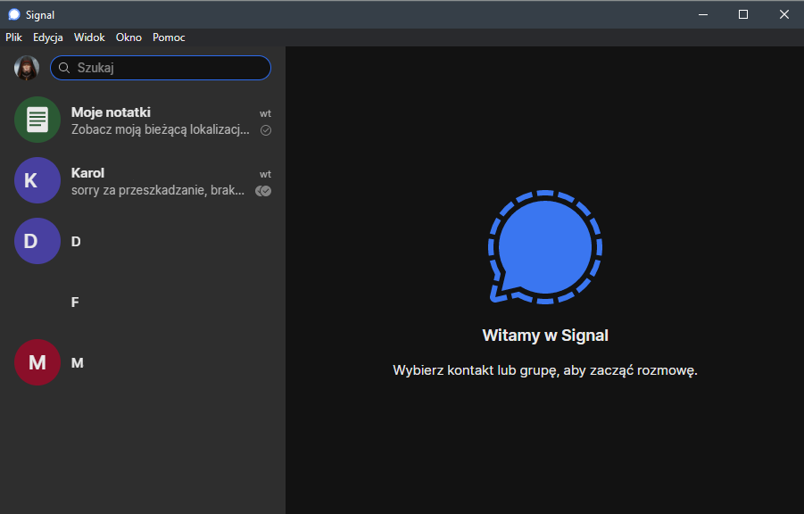
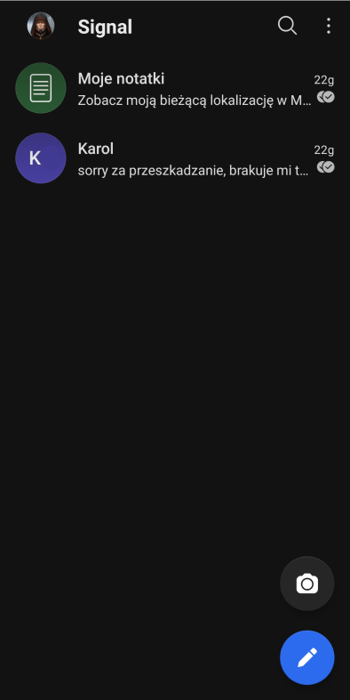

# Istniejące, funkcjonujące systemy: Signal

## Spis treści

- [Istniejące, funkcjonujące systemy: Signal](#istniejące-funkcjonujące-systemy-signal)
  - [Spis treści](#spis-treści)
  - [Wstęp](#wstęp)
  - [Prywatność](#prywatność)
  - [Możliwości przesyłania treści](#możliwości-przesyłania-treści)
  - [Więcej o lokalizacji](#więcej-o-lokalizacji)
  - [Dostępne klienty](#dostępne-klienty)
  - [Interfejsy graficzne](#interfejsy-graficzne)
  - [Podsumowanie](#podsumowanie)
  - [Źródła](#źródła)

## Wstęp

Signal jest otwartoźródłowym komunikatorem skupionym na zachowaniu prywatności użytkowników. Twórcą projektu jest organizacja non-profit Signal Technology Foundation, albo, w skróconej formie, Signal Foundation. Organizacja, oprócz tworzenia oprogramowania, zapewnia serwery potrzebne go korzystania z niego. Zarówno siedziba Signal Foundation jak i serwery znajdują się w Stanach Zjednoczonych.
## Prywatność
Wszystkie przesyłane za pośrednictwem Signal wiadomości, nawet grupowe, są szyfrowane ([szyfrowanie end-to-end](https://en.wikipedia.org/wiki/End-to-end_encryption)) a serwery nie przechowują ich treści w żadnej formie. Aplikacja zbiera absolutne minimum metadanych, w skład których wchodzą mało precyzyjne (z dokładnością do dnia) informacje o dacie ostatniego połączenia klienta z serwerem. Signal przechowuje historię wiadomości tylko lokalnie, w zaszyfrowanym archiwum. W razie potrzeby możliwe jest stworzenie szyfrowanej kopii zapasowej.
## Możliwości przesyłania treści
Komunikator uwzględnia możliwość wysłania różnych treści:  
- wiadomości tekstowe (z możliwością samozniszczenia po określonym czasie od otrzymania ich przez adresata).
- gify oraz naklejki dostarczane przez Giphy.
- wideo (z opcją wysyłania jednorazowych wiadomości)
- zdjęcia (z opcją wysyłania jednorazowych wiadomości)
- pliki
- kontakty
- lokalizacja (w formie adresu oraz odnośnika do pinezki w Google Maps)    

Umożliwa także wykonywanie połączeń głosowych i wideo. Niestety brakuje możliwości wysyłania wielu obrazków i filmów z galerii (czyli wcześniej zapisanych na telefonie) w formie wiadomości jednorazowych jednocześnie. Dodatkowo ustawienie dotyczące wiadomości jednorazowych jest globalne dla wszystkich wiadomości wysyłanych w ramach konwersacji od momentu jej włączenia, do momentu jej wyłączenia. Brakuje wygodnego przycisku pozwalającego wysłać pojedynczą wiadomość jako znikającą (Można to zrobić włączając znikające wiadomości, i wyłączając je od razu po wysłaniu, jednak nie jest to intuicyjne ani wygodne).
  
## Więcej o lokalizacji
Udostępnianie lokalizacji jest wygodne, jednak nie pozwala na aktualizację położenia telefonu na żywo. Można w tym celu wkorzystać z Google Maps, które pozwalają na udostępnienie linka do mapy pokazującej aktualne położenie telefonu przez dowolny komunikator, jednak funkcja ta nie jest wspierana przez aplikacje (brak podglądu na żywo), co oznacza że adresat będzie musiał otworzyć link w Google Maps albo przeglądarce.

  
*Zrzut ekranu 1 - Lokalizacja udostępniona w konwersacji na urządzeniu z systemem Android - źródło: materiały własne*
   
## Dostępne klienty
Nie istnieje klient webowy, który można znaleźć chociażby w Facebook Messenger. Dostępne są jednak aplikacje na poniższe platformy:  
- Android
- iOS
- Windows
- Mac
- Linux (oficjalne repozytorium z pakietami dla dystrybucji bazujących na Debianie)
- Linux (nieoficjalne pakiety w repozytoriach: Archa i OpenSUSE)
- Linux (nieoficjalne paczki snap i flatpak)
  
Aplikacje klienckie dla Androida i iOS są natywne, podczas gdy pozostałe bazują na frameworku Electron. Twórcy komunikatora nie planują tworzenia klienta w formie aplikacji webowej[[1]](#źródła). Wypowiedź jednego z moderatorów forum społeczności pozwala domniemać że ze względu na liczne potencjalne podatności oraz fakt, że w wypadku takiej aplikacji niemożliwe jest zapewnienie prawdziwego szyfrowania end-to-end[[2]](#źródła).

  
*Zrzut ekranu 2 - Lista kontaktów w aplikacji desktopowej w systemie Windows - źródło: materiały własne*  
  
*Zrzut ekranu 3 - Lista kontaktów na urządzeniu z systemem Android - źródło: materiały własne*

## Interfejsy graficzne
Przetestowane przeze mnie aplikacje mają wygodne i stosunkowo łatwe w użyciu interfejsy. Motywy aplikacji stosują się do systemowego ustawienia (jasny/ciemny interfejs). Ciemny motyw interfejsu jest przystosowany do ekranów OLED i AMOLED.  
Interfejs jest prosty i pozbawiony fajerwerków takich jak chociażby kolorowane gradientem tła wiadomości, obrazki w tle konwersacji czy animowane efekty czatu. Dla łatwego odróżniania konwersacji aplikacja pozwala ustawić kolor belki oraz teł wiadomości na jedną z 13 predefiniowanych barw.   
Umiejscowienie większości kontrolek jest logiczne i pokrywa się z tym do czego przyzwyczaiły swoich użytkowników inne popularne aplikacje tego typu. Na pochwałę zasługuje klawiatura emoji i naklejek, która wykorzystuje zestaw emoji definiowany przez aplikację, a nie przez system operacyjny. Dzięki temu użytkownicy nie spotkają się z nie wyświetlanymi, emotikonami których ich system nie obsługuje.     
Brakuje wspomnianego wcześniej skrótu do wysyłania znikających wiadomości, oraz znanych z Facebook Messenger dymków czatu.

## Podsumowanie
Signal jest aplikacją skupioną na prywatności i bezpieczeństwie. Pomimo to, oferuje funkcjonalność prównywalną z Whatsappem, Messengerem i innymi znanymi komunikatorami. Protokoły i funkcje zapewniające bezpieczeństwo zostały zaimplementowane w sposób nie wpływający negatywnie na interakcję użytkownika z aplikacją. 
Brakuje funkcji udostępnienia aktualnej lokalizacji przez określony czas. Obejściem tego braku jest udostępnienie linku z aktualizowaną lokalizacją z Map Google lub innej dającej taką możliwość aplikacji.  
Interfejy, zarówno w aplikacji mobilnej, jak i desktopowej, są intuicyjne. Sam przyzwyczaiłem się do nich w ciągu kilku minut. Dużą zaletą jest pełne i automatyczne dostosowanie kolorystyki interfejsu do motywu systemu, oraz dostosowanie ciemnego motywu do ekranów OLED i AMOLED.  
Dużą wadą, częściowo rekompensowaną dostępnością klienta desktopowego, jest brak klienta webowego, jednak wypowiedź moderatora forum w logiczny sposób wyjaśnia powód takiego stanu rzeczy[[1]](#źródła).  

## Źródła
[Blog Signal](https://signal.org/blog/)  
[3][Artykuły FAQ Signal](https://support.signal.org/hc/pl)  
Przeprowadzone samodzielnie testy poszczególnych funkcji aplikacji dla systemów Android i Windows.  
[1][Wypowiedź moderatora forum społeczności Signal o problemach dotyczących klientów webowych](https://community.signalusers.org/t/google-to-retire-chrome-apps-what-will-be-with-signal-desktop/469/6)  
[2][Wypowiedź jednego z developerów Signal na forum](https://community.signalusers.org/t/is-it-possible-to-extend-signal-for-desktop-for-browser/1151/3)