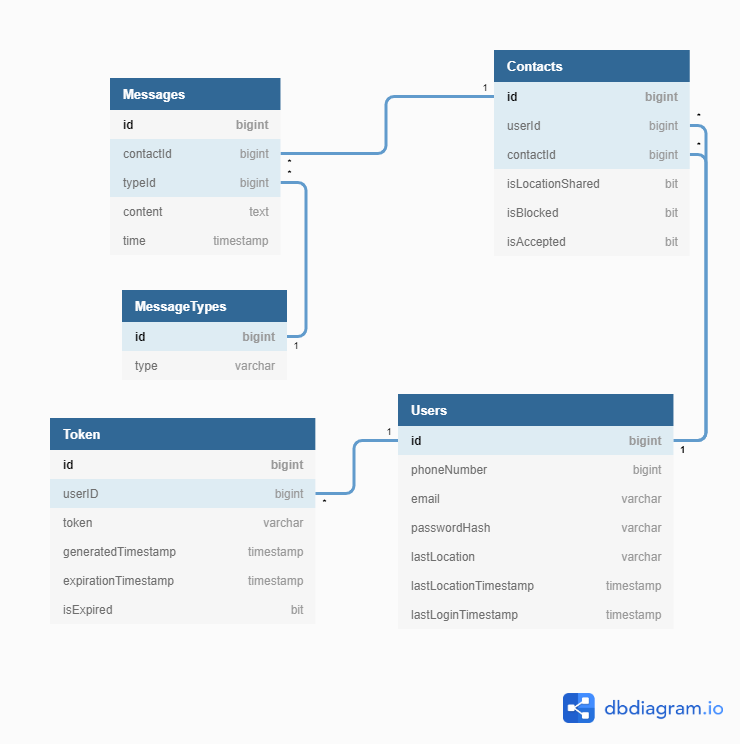

# ANALIZA SYSTEMU

### Spis treści

- [ANALIZA SYSTEMU](#analiza-systemu)
    - [Spis treści](#spis-treści)
- [Przedstawienie koncepcji systemu](#przedstawienie-koncepcji-systemu)
  - [Przeznaczenie systemu](#przeznaczenie-systemu)
  - [Konta użytkowników](#konta-użytkowników)
  - [Mechanizm autentykacji i zapamiętywania konta](#mechanizm-autentykacji-i-zapamiętywania-konta)
  - [Mechanizm listy kontaktów](#mechanizm-listy-kontaktów)
  - [Mechanizm czatu](#mechanizm-czatu)
  - [Mechanizm udostępniania lokalizacji](#mechanizm-udostępniania-lokalizacji)
  - [Interfejs](#interfejs)
- [Model Architektury systemu](#model-architektury-systemu)
  - [Diargam Architektury](#diargam-architektury)
  - [Opis i uzasadnienie](#opis-i-uzasadnienie)
- [Diagram hierarchii funkcji](#diagram-hierarchii-funkcji)
- [Diagram przypadków użycia:](#diagram-przypadków-użycia)
- [Opis modelu danych](#opis-modelu-danych)
  - [Identyfikacja obiektów w systemie](#identyfikacja-obiektów-w-systemie)
  - [Odwzorowanie obiektów na encje](#odwzorowanie-obiektów-na-encje)
  - [Tabele w bazie danych](#tabele-w-bazie-danych)
  - [Identyfikacja relacji między tabelami w bazie i ich rodzajów](#identyfikacja-relacji-między-tabelami-w-bazie-i-ich-rodzajów)
  - [Projekt bazy danych](#projekt-bazy-danych)

# Przedstawienie koncepcji systemu

Informacje zawarte w tym dokumencie mogą się zmieniać w trakcie prac nad projektem.
Projekt na potrzeby faz analizy, projektu oraz implementacji otrzymuje nazwę roboczą 'Ciat'.

## Przeznaczenie systemu

Celem powstania systemu jest umożliwienie użytkownikom komunikacji oraz udostępniania lokalizacji za pomocą aplikacji webowej przystosowanej zarówno do komputerów jak i urządzeń mobilnych.

## Konta użytkowników

Każde konto w systemie posiada unikalny identyfikator użytkownika, zwany również nazwą użytkownika. Identyfikator ten służy do przesyłania wiadomości, logowania użytkownika oraz odnajdywania użytkowników do dodania do listy kontaktów.  
Logowanie na konto wymaga podania hasła. Hasła są przechowywane w formie zasolonego i popieprzonego hasha uzyskanego za pomocą algorytmu Argon2.
Użytkownik może zmienić hasło do konta. Zmiana hasła odbywa się przez formularz, do którego link jest wysłany na adres email powiązany z kontem. Link jest jednorazowy i wygasa po godzinie od wysłania.

## Mechanizm autentykacji i zapamiętywania konta
Logowanie odbywa się za pośrednictwem formularza będącego częścią aplikacji klienckiej. Formularz przyjmuje adres email oraz hasło użytkownika, a następnie przesyła je na serwer. Jeśli kombinacja adresu email i hasła jest prawidłowa, serwer w odpowiedzi generuje token o określonym okresie ważności. Token jest następnie przechowywany przez aplikację i używany do potwierdzania tożsamości przy kontakcie z serwerem. Po wygaśnięciu tokenu konieczne jest ponowne zalogowanie się przez użytkownika.

## Mechanizm listy kontaktów

Każde konto ma powiązaną listę kontaktów. Dodanie użytkownika do listy kontaktów wymaga znajomości jego identyfikatora oraz zaakceptowania przez niego prośby o dodanie do kontaktów. Dodanie do kontaktów jest wzajemne (użytkownik A dodając do swoich kontaktów użytkownika B powoduje dodanie siebie do listy kontaktów użytkownika B ze statusem "oczekujący na zaakceptowanie"). Lista kontaktów umożliwia również zablokowanie użytkownika, co spowoduje ignorowanie wszystkich wysyłanych przez niego wiadomości do momentu odblokowania. Umożliwia też odblokowanie użytkownika. Wiadomości wysyłane przez kontakt do momentu odblokowania zostają utracone (nie są przechowywane na serwerze).

## Mechanizm czatu

Aplikacja kliencka umożliwia redagowanie i wysyłanie wiadomości tekstowych. Umożliwia również przesyłanie obrazków znajdujących się w pamięci urządzenia. Wiadomości można przesyłać tylko do użytkowników z listy kontaktów, za pośrednictwem serwera. Wiadomości są zorganizowane w konwersacje. Każda konwersacja odbywa się między dwoma użytkownikami. Serwer przechowuje historię przesyłanych wiadomości, również obrazkowych. Wiadomości są dostarczane do adresatów w jak najkrótszym czasie. Po wysłaniu wiadomości adresat powinien otrzymać powiadomienie push. 

## Mechanizm udostępniania lokalizacji

Aplikacja kliencka aktualizuje lokalizację urządzenia przechowywaną na serwerze kiedy jest uruchomiona (w minutowych odstępach). Ostatnia znana lokalizacja jest przechowywana na serwerze. Serwer umożliwia dostęp do lokalizacji użytkownikom znajdującym się na liście kontaktów którzy otrzymali na to zgodę od właściciela konta. Lokalizacja jest wyświetlana w aplikacji klienckiej jako pinezka na mapie.

## Interfejs
Interfejs aplikacji klienckiej powinien być podobny do innych znanych komunikatorów oraz aplikacji do wysyłania SMS. Ułatwi to użytkownikom zorientowanie się w nowej aplikacji.  
Minimum wymaganych komponentów lub widoków to:
- Lista kontaktów, służąca jednocześnie jako lista konwersacji. Naciśnięcie na kontakt powinno otwierać widok czatu dla tego kontaktu.
  - Kontakty powinny być opisane w sposób umożliwiający łatwą identyfikację.
  - Kontakt powinien wskazywać czy od ostatniego otwarcia konwersacji pojawiły się nowe wiadomości np. poprzez pogrubienie czcionki lub oznaczenie kolorem.
  - Kontakt powinien wskazywać czy udostępnia użytkownikowi aktualną lokalizację.
- Czat:
  - Przycisk służący do powrotu do listy kontaktów.
  - Lista wiadomości, wiadomości powinny mieć różne kolory i być wyrównane do prawej lub lewej strony ekranu. Posłuży to do zaznaczenia kto wysłał daną wiadomość.
  - Pole tekstowe do tworzenia wiadomości. W aplikacji webowej powinno reagować na naciśnięcie klawisza enter wysłaniem wiadomości, a na naciśnięcie kombinacji shift+enter wstawieniem znaku nowej linii.
  - Przycisk do wysłania wiadomości. Wysyła tekst znajdujący się w polu tekstowym jako nową wiadomość. Jeśli pole tekstowe jest puste lub zawiera jedynie białe znaki, naciśnięcie przycisku nie powoduje wysłania wiadomości.
  - Przycisk będący skrótem do wyboru obrazków do przesłania.
  - Przełącznik udostępniania lokalizacji
  - [Jeśli lokalizacja jest udostępniona] Przycisk otwierający mapę na której jest zaznaczona ostatnia znana serwerowi lokalizacja.

W celu zwiększenia czytelności i zmaksymalizowania dostępnej powierzchni ekranu najlepiej użyć ikon zamiast tekstu do opisu funkcji przycisków.  

# Model Architektury systemu

## Diargam Architektury 

## Opis i uzasadnienie

Do realizacji systemu został wybrany model trójwarstwowy, przygotowany pod aplikację internetową. 

Za przechowywanie danych odpowiada relacyjna baza danych, w której zbierane będą wszystkie informacje generowane przez system, oraz inne dane konfiguracyjne. Zgodnie z przygotowanym [modelem danych](https://github.com/impune-pl/projekt-zespolowy/blob/main/docs/Stage-2/data-model-description.md).

Drugą warstwą jest logika, odpowiada za nią aplikacja uruchomiona na serwerze. Jej rolą jest komunikacja z bazą danych oraz realizacja żądań wywoływanych z interfejsu użytkownika. Komunikacja z interfejesem realizowana jest poprzez API w celu ujednolicenia i ułatwienia komunikacji w systemie.

Trzecią i ostatnią warstwą jest sam interfejs użytkownika, to jedyny komponent systemu działający na urządzeniu końcowym. Jego zadaniem jest udostępnienie funkcjonalności oferowanych przez system oraz pobieranie od użytkownika wszelkich niezbędnych informacji i przekazywanie ich do drugiej warstwy systemu.

Taki podział architektury aplikacji został opracowany w celu rozdzielenia prezentacji od logiki i przechowywania danych. Zapewni to większą elastyczność systemu i ułatwi jego tworzenie oraz późniejszy rozwój i wprowadzanie aktualizacji. Dodatkowym atutem takiego podziału jest przydział zadań, za realizację pojedynczej warstwy odpowiada jeden członek zespołu. W realizacji zepół będzie oczywiście współpracować w poszczegolnych zadaniach.

# Diagram hierarchii funkcji

|Funkcja|Opis|
|-------|----|
|1.1. Wysłanie wiadomości | Umożliwia wysłanie wiadomości do współrozmówcy |
|1.2.	Odbieranie Wiadomości | Umożliwia odebranie wiadomości od współrozmówcy |
|1.3. Wyświetlanie listy wiadomości | Umożliwia wyświetlenie wiadomości wysłanych do danego użytkownika |
|2.1. Aktualizacja lokalizacji | Wysyła aktualną lokalizację na serwer w 5 minutowych odstępach czasowych |
|2.2. Wyświetlenie lokalizacji | Wysyła do użytkownika ostatnią odebraną przez funkcję 2.1 lokalizację danego współrozmówcy |
|2.3. Zablokowanie wyświetlenia lokalizacji | Blokuje możliwość aktualizacji lokalizacji dla danego współrozmówcy |
|3.1. Dodanie znajomego | Umożliwia dodanie użytkownika do listy znajomych | Umożliwia dodanie użytkownika do listy znajomych |
|3.1.1. Zaakceptowanie prośby o dodanie do znajomych | Umożliwia akceptację żądania dodania do listy użytkowników|
|3.2. Zablokowanie znajomego |Umożliwia zablokowanie wybranego użytkownika na liście znajomych|
|3.3. Wyświetlenie listy znajomych | Umożliwia wyświetlenie listy znajomych wraz z oczekującymi prośbami o dodanie do znajomych |  

# Diagram przypadków użycia:

# Opis modelu danych

## Identyfikacja obiektów w systemie

Na podstawie opisu sytemu oraz specyfikacji można zidentyfikować następujące obiekty:  
- Użytkownik
- Wiadomość
- Konwersacja
- Lista kontaktów
- Kontakt
- Token logowania

## Odwzorowanie obiektów na encje
Nie wszystkie obiekty muszą znaleźć się w bazie danych. Na przykład lista kontaktów może zostać przchowana jako pojedyncze kontakty w relacji wiele do jednego do użytkownika.

## Tabele w bazie danych 

Na podstawie obiektów w systemie zidentyfikowane zostały nasępujące tabele:
1. Użytkownicy - tabela zawierająca informacje potrzebne do identyfikacji i autentykacji użytkownika w systemie
2. Kontakty - tabela zawierające informacje o powiązaniach między użytkownikami w ramach listy kontaktów.
3. Wiadomości - tabela zawierająca wiadomości wymieniane w ramach konwersacji.
4. Tokeny - tabela przechowująca tokeny logowania oraz metadane ich dotyczące.
5. Rodzaje wiadomości - tabela przechowująca rodzaje wiadomości.

## Identyfikacja relacji między tabelami w bazie i ich rodzajów
Liczby w pierwszym wierszu i w pierwszej kolumnie odpowiadają numerom którymi oznaczono tabele w poprzedniej sekcji. Tabelę należy czytać wg. formuły [Wiersz][Relacja][Kolumna].
Możliwe rodzaje relacji to:
- 1:1 - relacja jeden do jednego
- 1:W - relacja jeden do wielu
- W:1 - relacja wiele do jednego
- W:W - relacja wiele do wielu

|   | 1 | 2 | 3 | 4 | 5 |
|---|---|---|---|---|---|
| 1 |   |1:W|   |1:W|   |
| 2 |W:1|   |1:W|   |   |
| 3 |   |W:1|   |   |W:1|
| 4 |W:1|   |   |   |   |
| 5 |   |   |1:W|   |   |
  
  
## Projekt bazy danych
Wstępny projekt bazy danych obrazujący relacje między tabelami oraz kolumny znajdujące się w tabelach jest widoczny na poniższym obrazku. 
