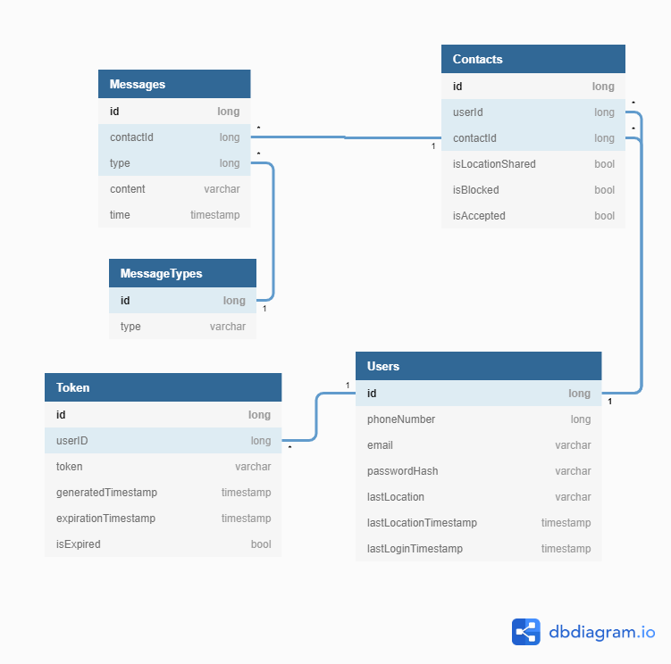

# Projekt bazy danych
Ten rozdział opisuje projekt bazy danych wykonany na potrzeby systemu.

## Opis bazy danych

PostgreSQL to relacyjny mechanizm zarządzania bazą danych oparty o POSTGRES 4.2 zaprojektowany na Uniwersytecie Berkeley. POSTGRES wprowadził wiele innowacji które pojawiły się w komercyjnych systemach zarządzania bazami danych długo po jego premierze.
PostgreSQL jest oprogramowaniem otwartoźródłowym, dostępnym na zasadach zawartych w licencji [PostgreSQL License](https://opensource.org/licenses/postgresql).  
PostgreSQL jest częściowo zgodne ze standardem SQL, i choć w niektórych przypadkach standard jest celowo ignorowany, to są one dobrze opisane i umotywowane np. chęcią zapewnienia wsparcia dla użytecznej funkcjonalności lub niejasną definicją zawartą w standardzie.

### Relacyjne bazy danych
Relacyjna baza danych to zbiór rekordów zapisanych w połączonych relacjami tabelach. Rozbicie danych na powiązane ze sobą tabele pozwala uniknąć przechowywania powtarzających się rekordów. W tym projekcie widać to doskonale w relacach między tabelami Messages, Contacts i Users. Gdyby nie relacje między nimi, powstałaby pojedyncza tabela w której każda wiadomość wymieniana między dwoma użytkownikami musiałaby zawierać pełne dane każdego z nich.  
W relacyjnej bazie danych każdy rekord może zostać jednoznacznie zidentyfikowany w obrębie tabeli dzięki kluczowi głównemu. Klucz główny może być złożony lub prosty. Prosty klucz jest w całości zawarty w obrębie jednej kolumny a jego wartości nie mogą się powtarzać, natomiast złożony łączy dwie lub więcej kolumn, co pozwala na istnienie wielu takich samych wartości w każdej z nich - dopiero finalne złożenie danych z kilku kolumn musi być unikalne w obrębie tabeli.  
Relacje od których ten typ bazy danych wziął swoją nazwę to powiązania między tabelami. Powstają przez umieszczenie w tabeli A wartości klucza głównego z tabeli B, oraz poinstruowanie systemu zarządzania bazą danych aby traktował to jako powiązanie. Kolumna zawierająca klucze główne pochodzące z innej tabeli jest nazywana kolumną klucza obcego.

## Diagram tabel oraz ich relacji
Obrazuje tabele, kolumny tabel wraz z typami danych, oraz relacje i typy relacji między tabelami.

## Opisy tabel i pól
Pola w rekordach, czyli kolumny w tabelach, to najmniejsze jednostki podziału informacji w modelu relacyjnym. Poniżej są opisane pola tabel widocznych na powyższym diagramie.

### MessageTypes
Służy do przechowywania typów zawartości jakie mogą znaleźć się w wiadomości.
| Nazwa | Typ     | Opis                                                  | Właściwości i ograniczenia                                  | PK                          | FK  |
| ----- | ------- | ----------------------------------------------------- | ----------------------------------------------------------- | --------------------------- | --- |
| id    | bigint  | Klucz główny tabeli.                                  | autoinkrementowane, unikalne, nie-null                      |  |     |
| type  | varchar | Ciąg znaków identyfikujący typ zawartości wiadomości. | nie-null, musi mieć wartość z listy dopuszczalnych wartości |                             |     |
  ----

### Messages
Służy do przechowywania wiadomości po ich wysłaniu przez użytkowników.
| Nazwa     | Typ       | Opis                                                                                                                 | Właściwości i ograniczenia                                                             | PK                          | FK                          |
| --------- | --------- | -------------------------------------------------------------------------------------------------------------------- | -------------------------------------------------------------------------------------- | --------------------------- | --------------------------- |
| id        | bigint    | Klucz główny tabeli.                                                                                                 | autoinkrementowane, unikalne, nie-null                                                 |  |                             |
| contactId | bigint    | Klucz obcy relacji wiele do jednego z tabelą Contacts.                                                               | nie-null, w tabeli Contacts musi istnieć klucz główny o korespondującej wartości       |                             |  |
| typeId    | bigint    | Klucz obcy relacji wiele do jednego z tabelą MessageTypes. Określa typ i format zawartości zapisanej w polu content. | nie-null, w tabeli MessageTypes musi istnieć klucz główny o odpowiadającej mu wartości |                             |  |
| content   | text      | Zawartość wiadomości. Korzysta z kodowania znaków UTF-8.                                                             | nie-puste                                                                              |                             |                             |
| time      | timestamp | Data i godzina (z dokładnością do sekund) wysłania wiadomości. Nie uwzględnia stref czasowych.                       | nie-null, nie może różnić się o więcej niż minutę od chwili wpisania do bazy           |                             |                             |
  ----

### Contacts
Służy do przechowywania kontaktów - powiązań między dwoma użytkownikami, a także informacji dotyczących stanu kontaktu.
| Nazwa            | Typ    | Opis                                                                                                    | Właściwości i ograniczenia                                                                                                                                                                                                                                                                   | PK                          | FK                          |
| ---------------- | ------ | ------------------------------------------------------------------------------------------------------- | -------------------------------------------------------------------------------------------------------------------------------------------------------------------------------------------------------------------------------------------------------------------------------------------- | --------------------------- | --------------------------- |
| id               | bigint | Klucz główny tabeli.                                                                                    | autoinkrementowane, unikalne, nie-null                                                                                                                                                                                                                                                       |  |                             |
| userId           | bigint | Klucz obcy relacji wiele do jednego z tabelą Users. Określa właściciela kontaktu.                       | nie-null, w tabeli Users musi istnieć klucz główny o korespondującej wartości                                                                                                                                                                                                                |                             |  |
| contactId        | bigint | Klucz obcy relacji wiele do jednego z tabelą Users. Określa użytkownika będącego obiektem kontaktu.     | nie-null, w tabeli Users musi istnieć klucz główny o odpowiadającej mu wartości                                                                                                                                                                                                              |                             |  |
| isLocationShared | bit    | Przechowuje stan współdzielenia lokalizacji (włączone/wyłączone) przez właściciela do obiektu kontaktu. | nie-null, domyślna wartośc 0 (fałsz)                                                                                                                                                                                                                                                         |                             |                             |
| isBlocked        | bit    | Przechowuje stan blokady obiektu kontaktu B przez właściciela A.                                        | nie-null, domyślna wartość 0 (fałsz)                                                                                                                                                                                                                                                         |                             |                             |
| isAccepted       | bit    | Przechowuje stan akceptacji prośby o kontakt (oczekująca/zaakceptowana)                                 | nie-null, domyślna wartość 0 (fałsz), zmiana wartości na 1 (prawda) w rekordzie opisującym kontakt między właścicielem A a obiektem kontaktu B powoduje utworzenie nowego rekordu opisującego kontakt między właścicielem B a obiektem kontaktu A (z wartością 1 (prawda) w polu isAccepted) |                             |                             |
    
  ----
### Users
Służy do przechowywania informacji o użytkownikach systemu.
| Nazwa                 | Typ       | Opis                                                        | Właściwości i ograniczenia                                                          | PK                          | FK  |
| --------------------- | --------- | ----------------------------------------------------------- | ----------------------------------------------------------------------------------- | --------------------------- | --- |
| id                    | bigint    | Klucz główny tabeli.                                        | autoinkrementowane, unikalne, nie-null                                              |  |     |
| phoneNumer            | varchar   | Numer telefonu użytkownika powiązany z kontem.              | unikalne, nie-null, nie-puste, sprawdzane pod kątem zgodności wyrażeniem regularnym |                             |     |
| email                 | varchar   | Adres email użytkownika powiązany z kontem.                 | unikalne, nie-null, nie-puste, sprawdzane pod kątem zgodności wyrażeniem regularnym |                             |     |
| passwordHash          | varchar   | Zasolony i popieprzony hash hasła użytkownika.              | określona długość, nie-null, nie-puste                                              |                             |     |
| lastLocation          | varchar   | Ciąg znaków określający lokalizację użytkownika.            | zmiana zawartości wyzwala aktualizację pola lastLocationTimestamp                   |                             |     |
| lastLocationTimestamp | timestamp | Data i czas ostatniej aktualizacji lokalizacji użytkownika. | aktualizowane automatycznie w momencie zmiany zawartości pola lastLocation.         |                             |     |
| lastLoginTimestamp    | timestamp | Data i czas ostatniego logowania użytkownika.               | aktualizowany przez serwer jako część procesu logowania użytkownika.                |                             |     |
  
  ----
### Token
Służy do przechowywania tokenów używanych do zachowania logowania użytkownika w aplikacji klienckiej. Ta tabela jest okresowo sprawdzana przez procedurę składową wywoływaną przez serwer w celu znalezienia i usunięcia wygaśniętych tokenów.
| Nazwa               | Typ       | Opis                                                                                                                                                                                             | Właściwości i ograniczenia                                                                                                                                                            | PK                          | FK                          |
| ------------------- | --------- | ------------------------------------------------------------------------------------------------------------------------------------------------------------------------------------------------ | ------------------------------------------------------------------------------------------------------------------------------------------------------------------------------------- | --------------------------- | --------------------------- |
| id                  | bigint    | Klucz główny tabeli.                                                                                                                                                                             | autoinkrementowane, unikalne, nie-null                                                                                                                                                |  |                             |
| userId              | bigint    | Klucz obcy relacji wiele do jednego z tabelą Users. Określa właściciela tokenu.                                                                                                                  | nie-null, w tabeli Users musi istnieć klucz główny o korespondującej wartości                                                                                                         |                             |  |
| token               | varchar   | Token służący do weryfikacji autentyczności zapytań z wysyłanych klienta oraz przechowywania logowania użytkownika.                                                                              | nie-null, nie-pusty, unikalny                                                                                                                                                         |                             |                             |
| generatedTimestamp  | timestamp | Określa moment wygenerowania tokenu. Nie uwzględnia stref czasowych.                                                                                                                             | nie-null, nie może różnić się o więcej niż minutę od chwili wpisania do bazy |                             |                             |
| expirationTimestamp | timestamp | Określa datę i czas wygaśnięcia tokenu. Nie uwzględnia stref czasowych.                                                                                                                          | nie-null, musi opisywać moment przyszły w stosunku do chwili wpisania do bazy                                                                                                         |                             |                             |
| isExpired           | bit       | Przechowuje informację o wygaśnięciu tokenu (przedwczesne wygaśnięcie następuje w wyniku wylogowania się użytkownika). Wygaśnięte tokeny muszą być przechowywane na wypadek próby podszycia się. | nie-null, domyślna wartość 0 (fałsz)                                                                                                                                                  |                             |                             |
  ----
## Opisy relacji
Relacja w relacyjnej bazie danych to logiczne powiązanie między dwiema tabelami (na potrzeby opisu nazwiemy je A i B). Istnieją cztery zdefiniowane typy relacji:
 - Jeden-do-Jednego - w tym typie relacji rekord w tabeli A odpowiada jednemu rekordowi w tabeli B, lub nie odpowiada żadnemu rekordowi. Kolumna klucza obcego może znajdować się w dowolnej z dwóch tabel.
 - Jeden-do-Wielu - w tym typie relacji rekord w tabeli A odpowiada dowolnej liczbie rekordów w tabeli B. Kolumna klucza obcego znajduje się w tabeli B.
 - Wiele-do-Jednego - odwrotność typu Jeden-do-Wielu.
 - Wiele-do-Wielu - w tym typie relacji zachodzi konieczność użycia dodatkowej tabeli (tabeli asocjacyjnej) C złożonej z minimum trzech kolumn (kolumna klucza głównego, kolumna klucza obcego tabeli A, kolumna klucza obcego tabeli B) aby rozłożyć niemożliwą do zmapowania za pomocą dwóch tabel relację wiele-do-wielu na dwie relacje jeden-do-wielu. 
  
  Poniżej znajdują się opisy relacji występujących w tej bazie danych.
  

### Relacja między MessageTypes a Messages
Jest to relacja typu Jeden-do-Wielu. Charakteryzuje się tym, że pojedynczy element po lewej stronie relacji może być powiązany z wieloma elementami po prawej stronie relacji. Ta relacja pozwoli uniknąć powtażania w każdym rekordzie w tabeli Messages ciągu znaków opisującego rodzaj treści zawarty w wiadomości.

### Relacja między Messages a Contacts
Jest to relacja typu Wiele-do-Jednego. Charakteryzuje się tym, że pojedynczy element po prawej stronie relacji może być powiązany z wieloma elementami po lewej stronie relacji. Celem uwzględnienia tej relacji jest powiązanie wysłanej wiadomości z dwoma użytkownikami - nadawcą i adresatem. Nadawcą wiadomości jest właściciel kontaktu - użytkownik którego klucz główny z tabeli Users znajduje się w polu userId, a adresatem użytkownik którego klucz główny znajduje się w polu contactId.

### Relacja między Users a Users
Jest to nieco nietypowa relacja Wiele-do-Wielu w której związek zachodzi między rekordami znajdującymi się w tej samej tabeli. Funkcję tabeli asocjacyjnej pełni tabela Contacts. Celem powstania tej relacji jest umożliwienie użytkownikom tworzenia kontaktów. W tej relacji tablica asocjacyjna, czyli Contacts, oprócz rozłożenia relacji Wiele-do-Wielu na dwie relacje Jeden-do-Wielu pełni dodatkowo funkcję połączenia między użytkownikami a wysłanymi przez nich wiadomościami, a także przechowuje informacje o preferencjach pozostających w kontakcie użytkowników.

### Relacja między Token a Users
Jest to relacja Wiele-do-Jednego, która wiąże użytkowników systemu z wykorzystywanymi przez aplikacje klienckie do zapisywania logowania tokenami. Ze względu na:
- Możliwość zalogowania jednego użytkownika z kilku aplikacji klienckich.
- Koniecznośc (ze względów bezpieczeństwa) przechowywania tokenów których ważność zakończyła się przedwcześnie, np. w skutek manualnego wylogowania przez użytkownika z aplikacji klienckiej, do momentu upłynięcia ich oryginalnej daty ważności.
Z jednym kontem użytkownika może być powiązane wiele tokenów.

## Opis mechanizmów bazy danych
Relacyjne bazy danych dostarczają różnych mechanizmów poprawiających ich funkcjonalność, niezawodność i użyteczność. Poniżej opisane są niektóre z nich.  

### Transakcje
To mechanizm umożliwiający współbierzny dostęp do bazy danych z zachowaniem niepodzielności, spójności, izolacji i trwałości. Ma duże znaczenie przy operacjach modyfikujących zawartość bazy danych.  
Transakcja to zestaw poleceń dla bazy danych które powinny zostać wykonane razem albo wcale. Niepodzielność transakcji oznacza że nie może zostać wykonana częściowo - albo cała transakcja kończy się pomyślnie i zostaje zastosowana, albo jest odrzucana. Spójność transakcji daje gwarancję że po jej wykonaniu nie pojawią się błędy w systemie. Izolacja pozwala na jednoczesne wykonywanie dwóch lub więcej transakcji np. na usunięcie w obrębie jednej transakcji rekordów odczytywanych przez drugą transakcję. Trwałość transakcji powoduje że system bazodanowy uruchomiony po nagłym przerwaniu pracy, np. po utracie zasilania lub poważnym błędzie systemu operacyjnego, będzie zawierał jedynie zmiany wprowadzone przez zatwierdzone transakcje.
Transakcje mogą zostać odrzucone w wyniku błędów, nagłego przerwania pracy systemu bazodanowego, lub wykonania polecenia odrzucenia w obrębie transakcji.

### Sprawdzanie i utrzymywanie więzów integralności
To mechanizm zapobiegający powstawaniu błędów integralności danych. Zapobiega między innymi dodawania kluczy obcych odnoszących się do nieistniejących rekordów, modyfikacji kluczy głównych i obcych w sposób który spowoduje osierocenie rekordów (rekordów które definiują relacje z nieistniejącymi rekordami), usuwaniu rekordów pozostających w relacji z innymi rekordami. Administrator bazy danych może konfigurować sprawdzanie więzów integralności 

### Wyzwalacze
To mechanizm pozwalający wykonać procedury w bazie danych w odpowiedzi na określone zdarzenia, np. modyfikację rekordu. Pozwala to uprościć wykonywanie niektórych zadań dla klienta, np. usuwanie jednego rekordu może uruchomić wyzwalacz sprawdzający czy istnieją rekordy powiązane i usuwający je w celu zachowania więzów integralności.

### Procedury składowane
To mechanizm pozwalający zachować zapytania po stronie bazy danych, dzięki czemu klient przekazuje jedynie polecenie wykonania konkretnej procedury zamiast całego zapytania. Pozwala przyspieszyć wykonywanie zapytań.