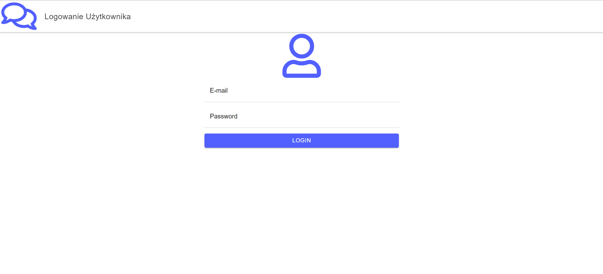
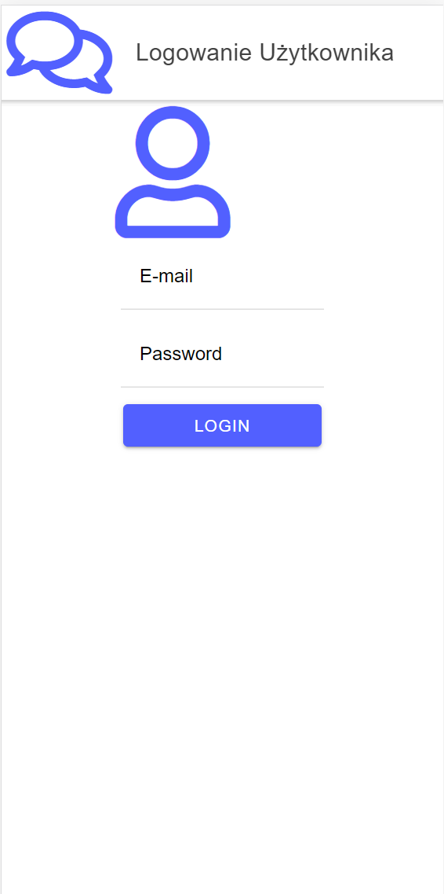
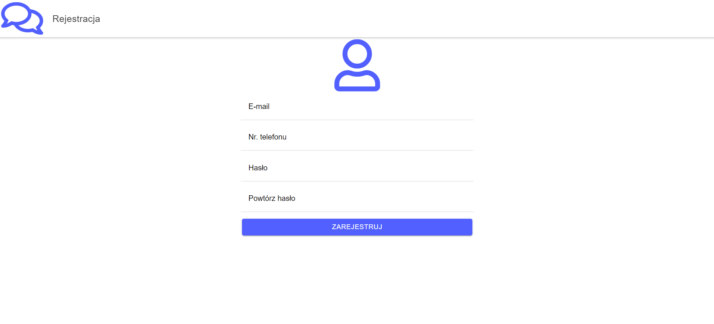
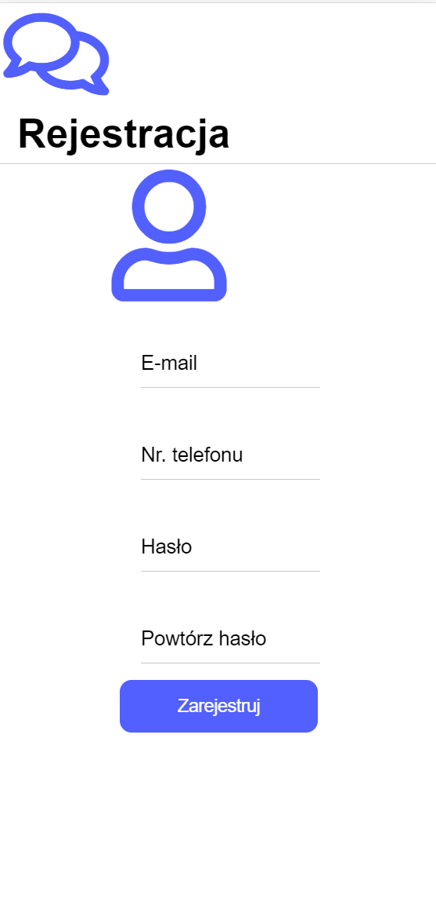
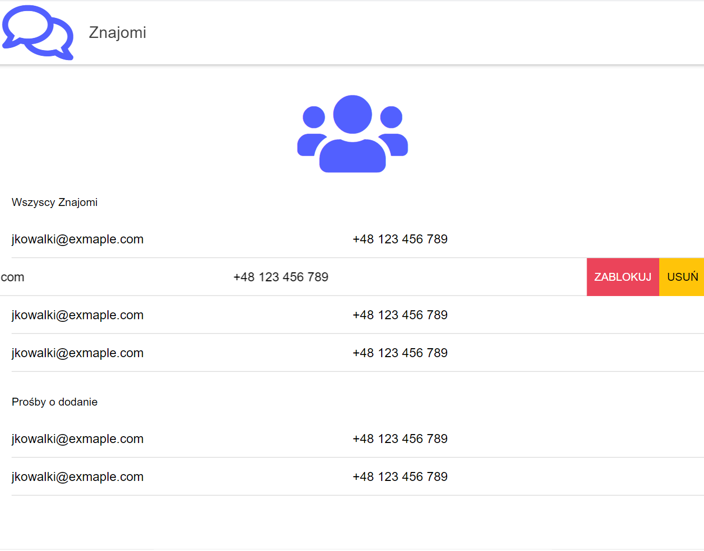
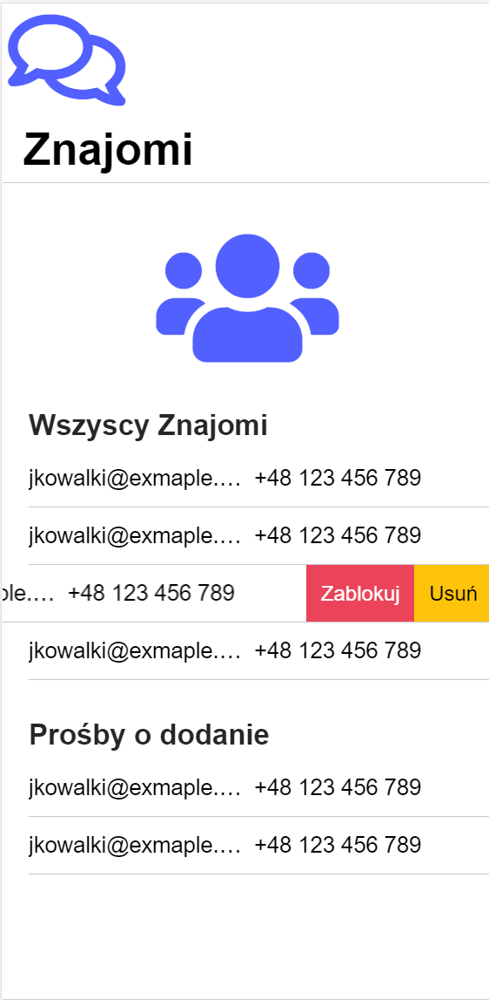
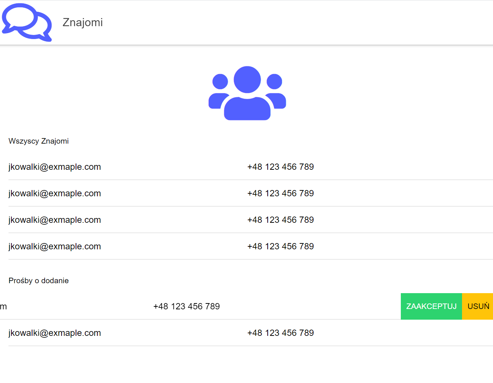
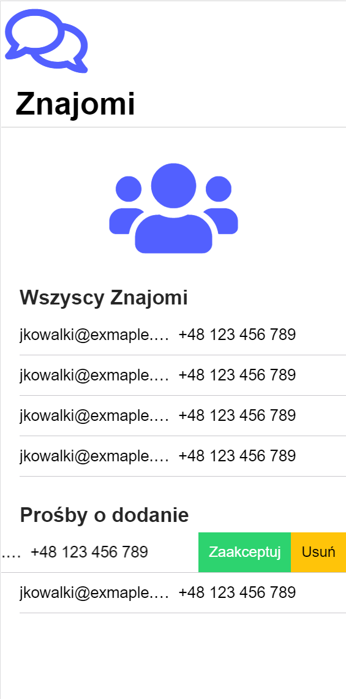
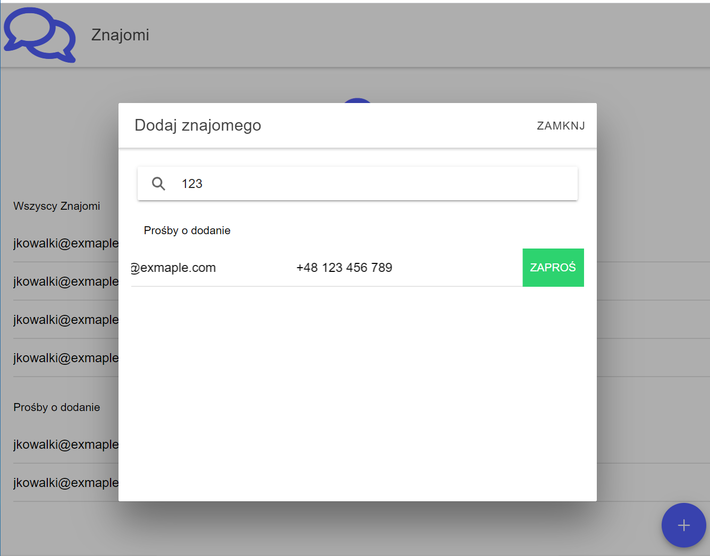

# Projekt interfeju użytkownika

Interfejs użytkownika prezentuje się insaczej w zależności od użądzania które go wyświetla. W przeglądarce elementy interfejsu przygotowują się pod większą powierzchnię ekranu, a na urządzeniu mobilnym interfejs umożliwia łatwą obsługę dotykiem. Elementy intefejsu na ekranie urządzenia mobilnego są też ułożone w bardziej kompaktowej, dla teleofonu, formie.

## Ekran logowania
Desktop            |  Mobile
:-------------------------:|:-------------------------:
  |  

## Ekran rejestracji
Desktop            |  Mobile
:-------------------------:|:-------------------------:
  |  

## Ekran wszystkich znajomych
Desktop            |  Mobile
:-------------------------:|:-------------------------:
  |  

## Ekran próśb o dodanie do znajomych
Desktop            |  Mobile
:-------------------------:|:-------------------------:
  |  

## Ekran dodania znajomego
Desktop            |  Mobile
:-------------------------:|:-------------------------:
  |  

## Ekran 
Desktop            |  Mobile
:-------------------------:|:-------------------------:
  |  

## Ekran 
Desktop            |  Mobile
:-------------------------:|:-------------------------:
  |  

