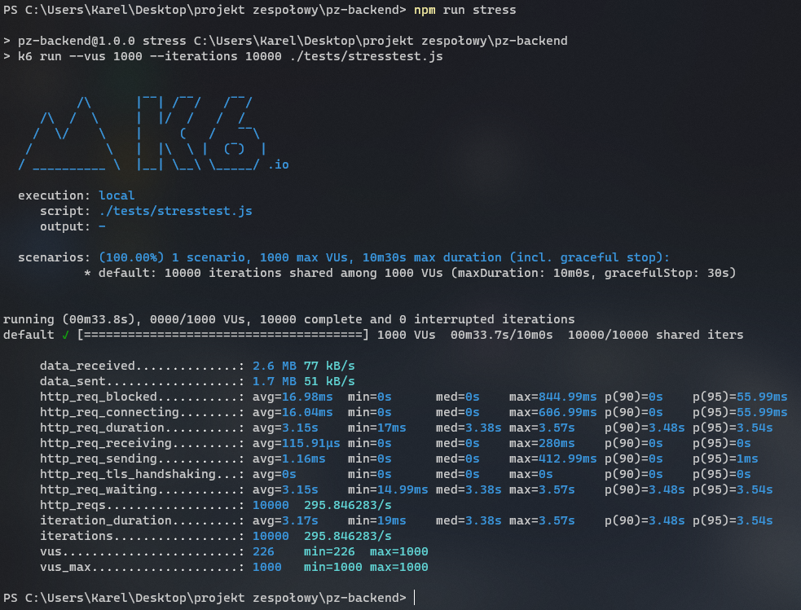

Testy poszczególnych modułów
--

Testy zostały wykonane dla poszczególnych przypadków:
- prawidłowe przesłanie pliku html /
- logowanie z prawidłowymi danymi
- logowanie z nieprawidłowymi danymi
- rejestracja z prawidłowymi danymi
- rejestracja z nieprawidłowymi danymi
- wysyłanie wiadomości z prawidłowymi danymi
- wysyłanie wiadomości ze żle podanym id kontaku
- wysyłanie wiadomości ze żle podanym id typu
- wysyłanie wiadomości z pustą wiadomością
- sprawdzenie nowych wiadomości z danymi zakładającymi isnienie nowszych wiadomości
- sprawdzenie nowych wiadomości z danymi nie zakładającymi isnienia nowszych wiadomości

Wyniki zostały przeprowadzone automatycznie z pomocą biblioteki [supertest](https://github.com/visionmedia/supertest). Testy przeszły prawidłowo, na co wskazuje informacja po ich ukończeniu

  

Testy obciążające
--

Dla warstwy logiki zostały przeprowadzone testy obciażające przy użyciu narzędzia [k6](https://k6.io/). Przeprowadzone zostało 10000 zapytań, używając 1000 klientów wirtualnych, wykonujących jednocześnie zapytania. Wyniki testów przedstawione są na grafice poniżej:

  
